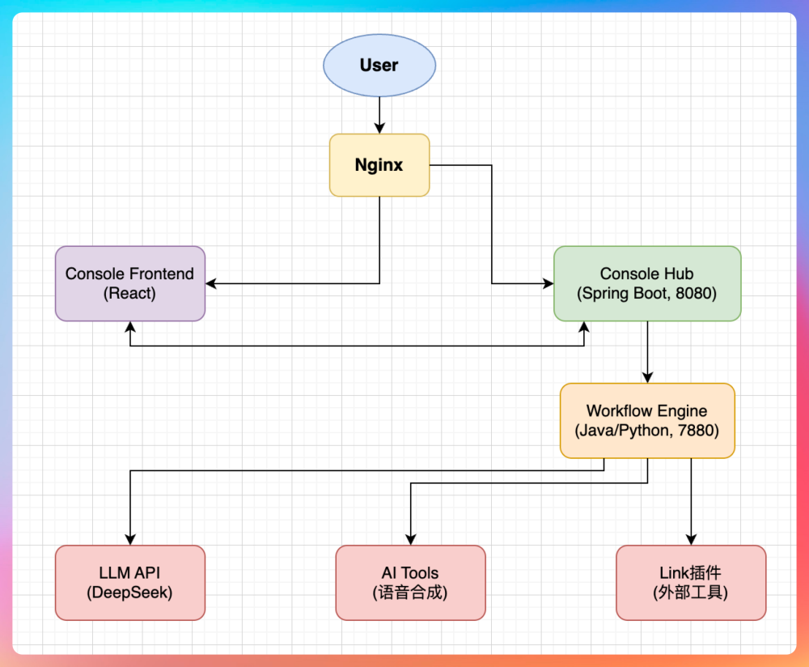

IntelligentFlow 是一个企业级的 AI 工作流编排平台，能让用户通过可视化拖拽的方式，把大模型、语音合成、各种插件工具串成一条自动化流水线，不用写代码就能构建自己的 AI 应用。类似 n8n、扣子、dify 等平台。

采用多语言微服务架构，前端 React 负责可视化编排，Spring Boot 做业务中台处理工作流编排，工作流执行可以用 Python 的 FastAPI + 自研引擎，也可以用 Java 版的 SpringAI + 自研LangGraph 版本。

实现了一套基于DAG的执行引擎，支持条件分支、并行执行、循环节点。每个节点执行完成会将输出数据写入VariablePool中，下游节点通过变量引用的方式可以拿到上游节点的数据。执行状态会被持久化到数据库，如果中间某个节点执行失败了，支持节点重试，不用整个流程重跑。

另一个技术挑战是插件体系的设计。我们的工作流不只是调大模型，还要能调各种外部工具，比如语音合成、图片生成、RPA 操作等。我们基于 MCP 协议做了一套插件机制，外部工具只要按照标准的 Schema 注册进来，就能作为节点被编排。

另外，我们全链路接入了 OpenTelemetry。一个工作流跑下来可能调了三四个服务，如果出问题了，通过 TraceID 能把整条链路的日志、耗时、错误信息全部串起来看，定位问题很快。

部署这块我们做了 Docker Compose 一键启动，十几个服务的依赖关系、环境变量、网络配置全部封装好了，首次部署稍微花点时间，但所有依赖下载完成也差不多 30 分钟左右。

用户在前端保存一个工作流，实际上是 Hub 把流程定义存到 MySQL 里；用户点击运行，Hub 会把请求转发给下游的工作流引擎。

