IntelligentFlow 是一个企业级的 AI 工作流编排平台，能让用户通过可视化拖拽的方式，把大模型、语音合成、各种插件工具串成一条自动化流水线，不用写代码就能构建自己的 AI 应用。类似 n8n、扣子、dify 等平台。

采用多语言微服务架构，前端 React 负责可视化编排，Spring Boot 做业务中台处理工作流编排，工作流执行可以用 Python 的 FastAPI + 自研引擎，也可以用 Java 版的 SpringAI + 自研LangGraph 版本。

实现了一套基于DAG的执行引擎，支持条件分支、并行执行、循环节点。每个节点执行完成会将输出数据写入VariablePool中，下游节点通过变量引用的方式可以拿到上游节点的数据。执行状态会被持久化到数据库，如果中间某个节点执行失败了，支持节点重试，不用整个流程重跑。

另一个技术挑战是插件体系的设计。我们的工作流不只是调大模型，还要能调各种外部工具，比如语音合成、图片生成、RPA 操作等。我们基于 MCP 协议做了一套插件机制，外部工具只要按照标准的 Schema 注册进来，就能作为节点被编排。

另外，我们全链路接入了 OpenTelemetry。一个工作流跑下来可能调了三四个服务，如果出问题了，通过 TraceID 能把整条链路的日志、耗时、错误信息全部串起来看，定位问题很快。

部署这块我们做了 Docker Compose 一键启动，十几个服务的依赖关系、环境变量、网络配置全部封装好了，首次部署稍微花点时间，但所有依赖下载完成也差不多 30 分钟左右。

用户在前端保存一个工作流，实际上是 Hub 把流程定义存到 MySQL 里；用户点击运行，Hub 会把请求转发给下游的工作流引擎。

容器化的好处：
    1. 容器把应用和它的运行环境打包在一起，不管底层是什么系统，容器内部的环境是完全一样的。开发生产用同一个镜像，环境问题基本就消失了。
    2. 依赖隔离，我们项目里有 Java 服务、Python 服务，还有 MySQL、Redis、MinIO 等等。传统部署要在一台机器上装一堆东西，版本冲突、端口冲突、依赖污染都是常见问题。容器化之后每个服务跑在独立的容器里，互不干扰，想用什么版本就用什么版本
    3. 部署效率提高，传统部署要写一堆脚本，停服务、拉代码、装依赖、改配置、起服务，还要考虑回滚方案。容器化之后，docker compose up -d 一条命令，所有服务按照定义好的顺序启动，配置、网络、依赖关系全部自动处理。回滚也简单，把镜像 tag 换回上一个版本重新 up 就行

Link的作用是一个工具调度中心，单独抽出来的作用是
    1: 工作流引擎在执行到插件节点时，不会自己去调用语音合成、图片生成这些能力，而是把请求转发给 Link，由 Link 去调用实际的工具服务，拿到结果再返回给引擎。Link 就像一个中间代理，屏蔽了底层工具的差异性。引擎只管按照标准格式调 Link，具体怎么调用底层工具是 Link 的事。
对内暴露统一的调用接口，对外适配各种协议。
    2: 工具不是静态的，要支持动态注册、更新、下线。工具的元信息（参数定义、返回结构、调用地址）存在数据库里，Link 负责读取这些配置，按照配置去调用工具。新增工具只需要往数据库里写一条记录，不用改代码、不用重启服务。这种配置化的方式让系统的扩展性很好。
    3: 和 MCP 协议的集成。MCP 是现在 AI 领域比较流行的工具协议，很多第三方能力都在往这个标准靠。Link 实现了 MCP 客户端，可以对接符合 MCP 标准的工具服务器。这样外部的工具生态可以直接接入，不用为每个工具单独开发适配器。
    4: 故障隔离，调用工具是最不可控的部分，外部服务可能超时、出错、返回错误格式等，把这些不确定性封装在Link中，引擎只需要处理Link返回的标准结果。Link 内部可以做重试、降级、熔断这些容错逻辑，不让外部工具的问题影响到核心的工作流执行。

OpenAPI是描述RESR API的标准格式。用他来定义工具的调用方式。一个工具的 OpenAPI Schema 主要包含了插件的基本信息，API 的请求参数等。
解析流程为 查询数据库中工具的Schema -> 解析Schema中的服务地址 -> 根据operationId找到对应的Path和Method -> 封装成Http请求发起调用

支持的认证方式为 1. API key（Header方式）2. API key（query方式）3. Bearer Token 【headers.put("Authorization", "Bearer " + token);OAuth2 授权之后拿到的 access_token 一般都用这种方式传递】
这里的认证信息存储到了Redis中，配置和代码分离，改密钥不需要重启服务

缓存和数据库的一致性：用的是Cache Aside模式，读的时候先查缓存，缓存没有就查询数据库然后将数据写回缓存。写的时候先更新数据库，再删除缓存。用删除不用更新，可以避免并发写导致的数据不一致。

有关分布式锁，再简单业务情况下，用注解@DitributedLock就可以解决，背后是AOP切面在干活，锁的key支持SpEL表达式，#{#userId}会被解析成实际的参数值，这样不同的用户的更新操作可以并行，同一个用户的更新才会互斥。对于复杂调度业务，用手动实现的版本。

分布式 **id 时间（秒级）+ 数据中心（3 位）+ 机器 ID（7 位）+ 序列号（10 位）**其中机器 ID（7 位）根据本机ip地址计算，取ip最后一段作为运算，确保同一网段内的不同机器的
id不一样。这是本地计算，相比依赖于Redis INCR或者数据库号段模式，网络开销减小很多。

窗口边界突刺：假设我们用简单的计数器实现，每分钟限制 100 次。用户可以在第 59 秒打 100 次，然后在第 61 秒再打 100 次，两秒钟内打了 200 次，实际上会绕过限流。令牌桶算法没有这个问题，它是匀速生成令牌的，流量天然是平滑的。
Key 的设计是 rate_limit:接口名:维度:标识，这样不同接口、不同用户的限流计数是隔离的。限流触发后的处理也很讲究。不是简单地返回错误，而是记录日志、输出限流 key，方便排查是哪个用户或者哪个 IP 触发了限流。如果是正常用户被误杀，可以快速定位；如果是恶意攻击，也能及时发现。

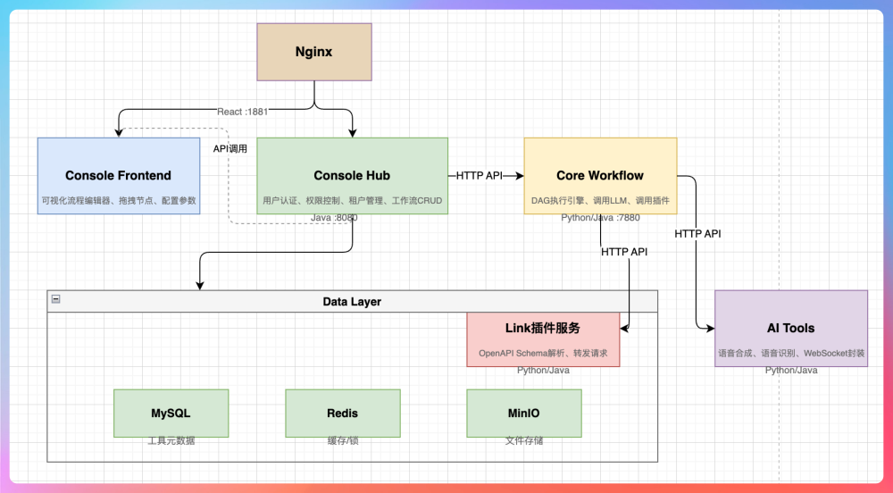
Console Hub是业务中台，java写的，8080端口，负责用户登录、工作流的增删改查、工具市场管理、权限控制、租户管理。用户在前端的大部分操作，比如创建一个工作流、配置节点参数、保存发布，都是 Hub 在处理。
Console Frontend 是前端界面，React 写的，开发时跑在 1881 端口。核心是一个可视化的流程编辑器，用户在这里拖拽节点、连线、配置参数。它只做展示和交互，所有数据都通过 API 从后端获取。
Core Workflow 是工作流执行引擎，分为 Python 和 Java 两个版本，跑在 7880 端口。Hub 管的是"定义"，它管的是"执行"。用户点击运行，Hub 把流程定义和输入参数丢给 workflow，它按照 DAG 的顺序一个节点一个节点地执行，调大模型、调插件，最后把结果返回。
Link 是工具调度服务，有 Java 和 Python 两个版本。它是工作流引擎和外部工具之间的桥梁。引擎执行到插件节点时，不是自己去调外部 API，而是把请求转给 Link，Link 根据工具的 OpenAPI Schema 解析出该怎么调用，然后转发请求、处理响应。这样新增工具只需要注册 Schema，不用改引擎代码。
AI Tools 是 AI 能力的封装服务，也是有 Python 和 Java 两个版本。语音合成、语音识别这些能力的 SDK 调用都在这里。比如讯飞的 TTS 用的是 WebSocket 协议，调用逻辑比较复杂，我们把它封装成一个简单的 HTTP 接口，其他服务调用就方便多了。
Nginx 是统一入口，所有请求先到 Nginx，由它根据路径转发到不同的后端服务。前端静态资源也是 Nginx 托管的。加上 gzip 压缩、缓存控制、HTTPS 这些，都在 Nginx 这一层处理。
数据服务包括 MySQL、Redis、MinIO。MySQL 存工具元数据、工作流和业务配置，Redis 做缓存和分布式锁，MinIO 存文件。

Http调试方便，crul就能做，本项目没有使用RPC框架。LLM的相关生态绝大多数基于HTTP/SSE，使用HTTTP可以降级协议转换成本
流式场景使用SSE
服务发现用 Docker 内网 DNS，容器名就是服务名，天然支持DNS发现
（# docker-compose.yml
services:
core-workflow:
hostname: core-workflow  # 其他服务用这个名字访问）

OpenTelemetry 是一套可观测性的开源标准和工具集。用OpenTwlwmetry的SDK埋点，数据可以导出到任何兼容的后端，不用改业务代码。

服务降级的核心是有损服务优于无服务，系统出问题的时候，与其整体崩掉让用户看到一堆报错，不如关掉一些非核心功能，保住核心链路能用。
最终一致性：用户创建工作流 -> Console Hub存到数据库 -> 同步到WorkFlow Engine
    1. 大部分场景是同步的，Hub调用WorkFlow Engine 失败就回滚
    2. 接口设计幂等
    3. 补偿机制，下游失败，上层做补偿
    4. 异步场景用消息队列，如果需要真正的异步解耦，可以用 Kafka

熔断器的三个状态：CLOSED 正常调用、OPEN 直接走降级，不再调用下游、HALF_OPEN 试探性调用，成功则回复。我们的项目使用根据配置的ErrorStrategy决定是报错还是使用默认值
具体实现是外部依赖降级 + 内部服务降级（workflow压力大使用hub层进行限流，超出阈值部分直接拒绝请求） + 读写分离降级（数据库压力大转为只读模式，用户能查看历史纪录但不能发起新任务）

AI Agent相比普通LLM调用，不知能回答问题，还能规划任务（面对一个复杂任务，会将它拆分为一个个小任务，然后一步步执行）、使用工具（调用搜索引擎、查询天气等，再把结果喂回给LLM）、循环思考（"感知-决策-行动"的循环，是 Agent 的核心特征，例如发现信息不够会自己搜集），直到完成目标

ReAct = Reasoning + Acting 是一种让大模型边思考边行动（交替思考和行动）的范式
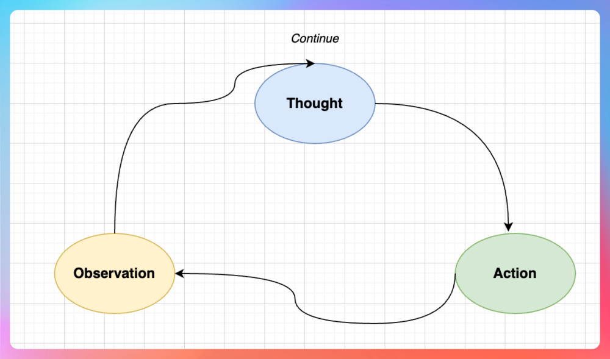
本项目的AgentNode中有reasoning、answer、query三个部分，我们通过 prompt 告诉 LLM "先推理你需要做什么，然后决定调用哪个工具，最后根据结果给出答案"。

RAG（检索增强生成）: 大模型的知识是训练时固定的，可能过时或者不全。RAG 就是在调用大模型前，先从知识库里检索相关内容，塞到 Prompt 里，让大模型"看着资料回答"。
用户内容 -> 向量化 -> 在向量数据库中检索相关内容 -> 将文档内容+用户问题组装成Prompt发送给LLM -> 调用大模型 -> 返回答案
RAG的优点为**知识可更新、可追溯来源、大幅减少大模型幻觉**。

FunctionCalling是工具调用，让大模型调用外部函数/API的能力。工具描述要说清楚，大模型是依靠Prompt里的工具描述（name和description）来选择调用最符合的工具。

MCP 是 Anthropic 提出的"模型上下文协议"，目的是标准化大模型和外部工具的交互方式。以前每个工具都要单独对接，写一堆适配代码。MCP 定义了统一的协议，工具实现 MCP Server，应用实现 MCP Client，就能互联互通。
MCP核心概念有Resources：只读数据源（文件、数据库）、Tools：可执行的功能（API 调用、代码执行）、Prompts：预定义的提示词模板。通信方式有stdio：通过标准输入输出通信，适合本地工具、SSE：通过 HTTP SSE 通信，适合远程服务。

FunctionCall&MCP ： FunctionCall是函数调用，允许LLM根据用户的自然语言输入识别他需要什么工具以及格式化的工具调用的能力；MCP提供了一个通用的协议框架来发现、定义、以及调用外部系统提供的工具能力。两个是协作关系不是替代关系。

Agent规划：Agent能把一个复杂任务分解为多个子任务，然后按顺序或并行执行。简单场景用预定义工作流保证可控，复杂场景用 AgentNode 实现动态规划。

多 Agent 协作是让多个 Agent 一起完成任务，每个 Agent 有自己的角色和专长。AutoGen、CrewAI、LangGraph、MetaGpt等。
常见的协作模式：分工型、讨论型、层级型。

设计自主决策的AI Agent
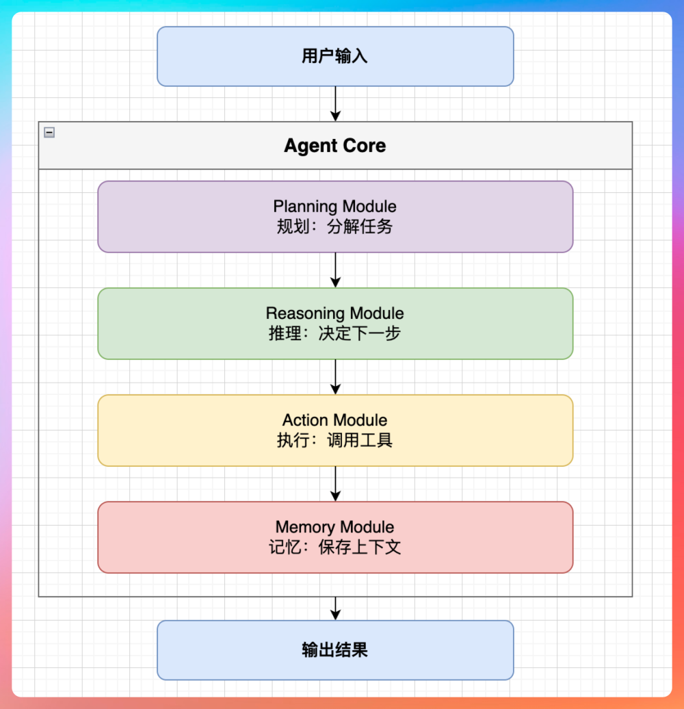

Skills 是 Anthropic 为 Claude 预置的一套最佳实践指南，本质上是一些 SKILL.md 文件，里面包含了针对特定任务的详细操作步骤和注意事项。Skills 更像是"操作手册"或"最佳实践文档"，是静态的知识，不是实时调用的能力。
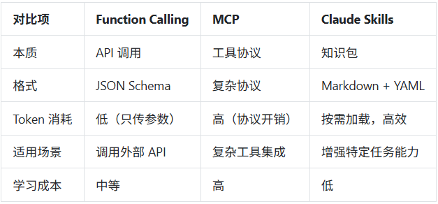

一个标准的 Skill 目录结构：
my-skill/
├── SKILL.md              # 必需，技能定义文件
├── examples/             # 可选，使用示例
│   ├── example1.md
│   └── example2.md
├── scripts/              # 可选，辅助脚本
│   └── helper.py
└── resources/            # 可选，其他资源
└── template.json

SKILL.md 文件格式：
---
name: pdf-processor （必填）
description: 帮助 Claude 更好地处理 PDF 文件，包括提取表单字段、填写 PDF、转换格式等 （必填）
---

# PDF 处理技能

## 能力说明
这个技能让你能够：
1. 提取 PDF 中的表单字段
2. 填写 PDF 表单
3. 将 PDF 转换为其他格式

## 使用指南

### 提取表单字段
当用户要求提取 PDF 表单时，使用以下步骤：
1. 首先分析 PDF 结构
2. 识别所有表单字段
3. 输出字段列表，包含字段名、类型、当前值

### 填写表单
...

## 示例
参见 examples/ 目录中的具体用例

## 注意事项
- 处理大型 PDF 时要注意内存
- 某些加密 PDF 可能无法处理

Skills的**渐进式披露**（Progressive Disclosure）：是Skills的最核心的设计思想，解决的是上下文窗口有限的问题。传统做法是将所有工具说明、使用指南都塞进 System Prompt，导致：Token 消耗巨大（可能几万 Token 的说明）、无关信息干扰模型判断、上下文空间被挤占。
而Skills是分阶段、按需的香LLM提供关于可用工具的信息，而不是一次性将所有工具的全部细节都塞进提示词中 。
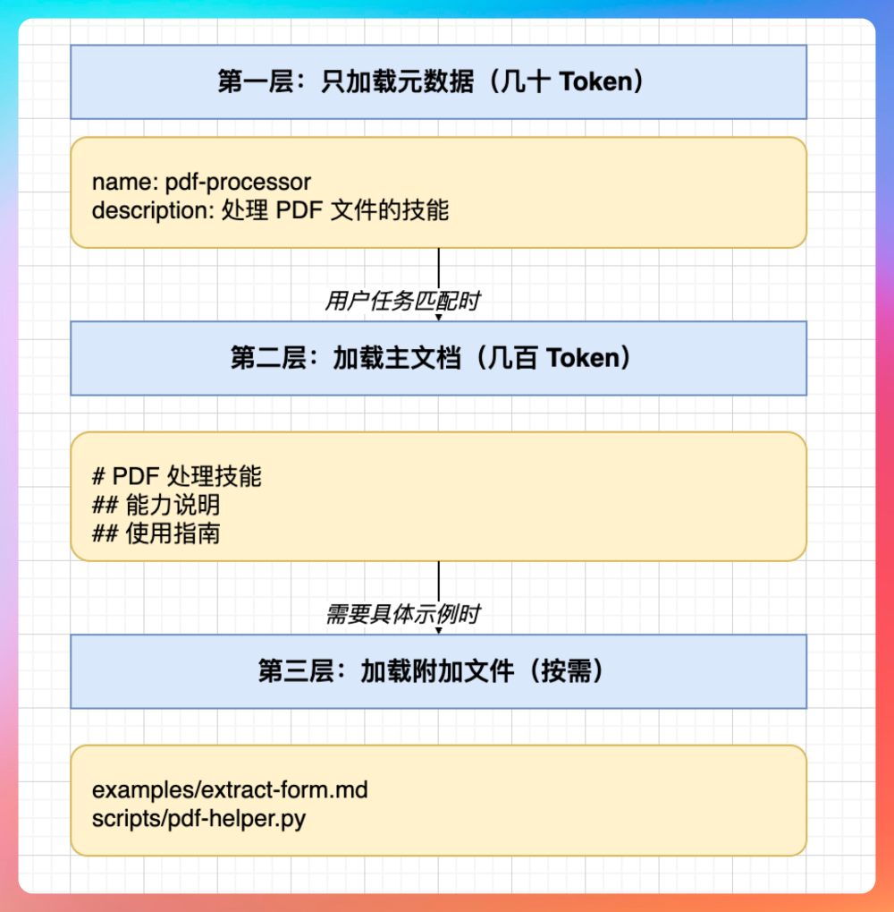

使用时机

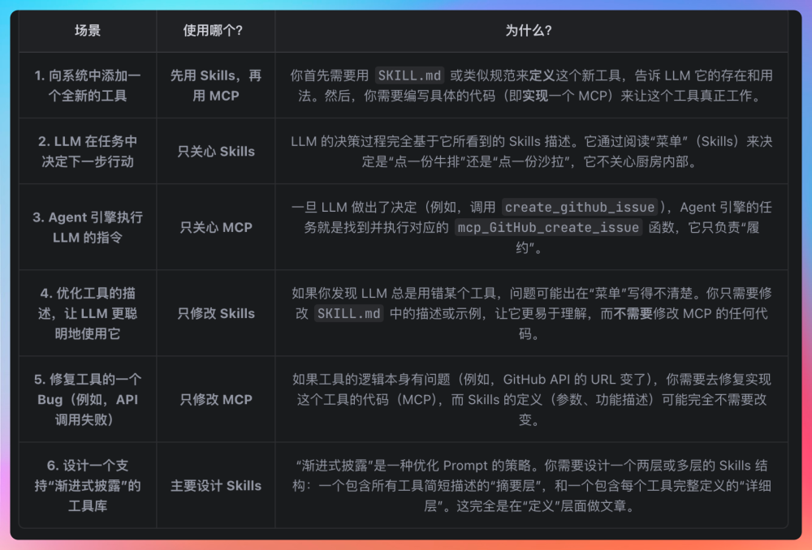

用到的设计模式：
    1. 策略模式，不同类型节点（LLM节点、Plugin节点、Knowledge节点等）有不同执行逻辑，通过接口多态实现
    2. 模板方法模式，父类定义骨架（所有节点都继承AbstractNodeExecutor），子类实现具体逻辑。新增节点只需要继承AbstractNodeExecutor，实现execute方法
    3. 工厂模式，根据配置动态创建不同的模型客户端
    4. 观察者模式，节点执行状态变化通过回调通知，体现在流式输出和执行状态通知两个场景
    5. 装饰器模式，用来"增强"一个对象的功能，而不改变它的接口。分布式锁和限流都是用AOP实现的，还比如TTL包装线程池。相比继承来说，装饰器模式是动态的
NodeExecutor接口的多态实现体现了开闭原则（对扩展开放对修改关闭）、依赖倒置原则（高层模块不依赖底层模块都依赖抽象类）、里氏替换原则（所有子类都能替换父类使用，并且行为一致）和单一职责原则（每个节点执行器只负责一种节点的执行逻辑）。

SSE是一种服务器像客户端单向推送数据的技术，基于http协议，和WebSocket的主要区别是：

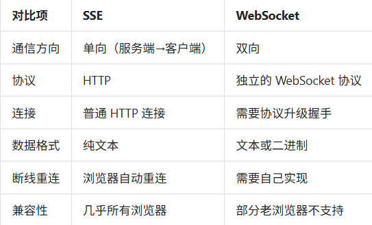

选用SSE是因为场景匹配，大模型的输出是服务端单项推送给前端，不需要双向通信，并且不需要额外的配置，nginx也好配置。
SSE的数据格式：

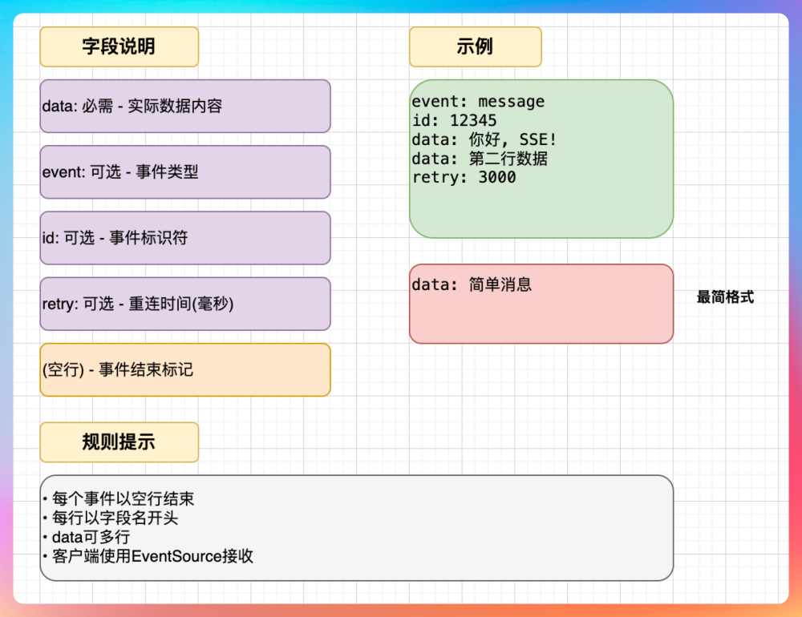

实现方式是SpringBoot提供了SseEmitter类实现SSE（设置超时时间为5min，及覆盖大部分正常请求，又不让异常连接占用太久资源），有些代理服务器会断开长时间没数据的连接，所以要定期发送心跳，保持连接活跃。
在Intelligent中，Hub负责接收前端请求，通过http调用workflow引擎，workflow引擎返回的也是SSE流，hub层每接收到一个chunk立刻转发给前端一个chunk，实现端到端的流式体验。
正常完成，触发 onCompletion 回调；超时，触发onTimeout 回调，并且主动关闭连接清理资源；客户端主动断开，触发onError 回调。但是有一个问题，就是异步线程可能还在往emitter中发送数据，但是此时连接已经断开了，所以我设计了一个AtomicBoolean标记为来标记连接状态，三个回调中都将替他设计为false，这样每次发送前检测，如果断开就不发送数据了。

首字响应延迟（TTFT）指从用户发送请求到看到第一个字的时间。这个指标对用户体验十分重要，哪怕后面生成得再快，如果开头要等两三秒，用户就会觉得"卡"。优化的关键是**减少各环节的等待时间**。
优化方式：
    1. HTTP连接复用，每次请求新建TCP连接很慢，三次握手就要几十毫秒。我们用OkHttp连接池复用已有连接。这样大部分请求能直接复用链接，省掉了TCP握手的时间。
    2. LLM 调用优化。LLM 服务响应是最大的延迟来源。要尽量减少 prompt 长度，提供 Skills 这些技术给 LLM，以减少 prompt 长度。另外，我们对历史对话也做了截断和压缩：
    3. 使用流式接口。确保用的是 LLM 的 stream 模式，而不是等全部生成完再返回。
    4. 非关键路径异步化，有些操作不影响首字输出，可以放到后台异步执行。比如日志记录、统计埋点。
    5. 并行预处理，有些前置操作可以并行执行。比如校验用户权限、加载工作流配置、检查限流，这些互不依赖，可以并行。对这些操作统一使用CompletableFuture.supplyAsync进行调用，最后使用CompletableFuture.allOf(...,...,...,).join()来等待所有前置检查完成。

流式响应中，如何保证消息的有序性？我们响应链路大致是LLM 服务 → Workflow 引擎 → Hub 服务 → Nginx → 前端。理论上TCP保证了传输层的有序性，但是实际中使用多线程处理消息，线程的调度顺序是不确定的，所以要在应用层自己保证有序性。
一开始使用newSingleThreadExecutor每个 SSE 连接的消息发送都在同一个线程里顺序执行，但是并发量上来就会成为瓶颈。接着我们为每一个会话创建一个队列。每个会话有自己的队列和发送线程，消息先进先出，天然保证顺序。不同会话之间互不影响，也不会有并发瓶颈。同时，及时发送端保证了顺序，也要提防网络传输或者中间件出现问题，于是为每一个信息加上序号，前端可以据此校验和排序，因为SSE协议本身支持ID字段，可以把序号放在 id 里，让序号作为事件id。
前端收到消息后，不能直接渲染，要先检查序号是否连续。如果发现有跳号，说明有消息乱序或丢失，需要处理（加入到缓冲队列中）。

双队列架构消除 SSE 响应乱序与丢包：工作流执行时，可能多个节点同时产生输出，每个LLM节点的流式输出是异步的，直接往SseEmitter写消息会乱序。使用双队列架构，将接受和发送彻底解耦，用两个独立的队列：接收队列专门负责从上游接收数据，快速入队，不做复杂处理；发送队列存放待发送的、已经排好序的消息，发送线程从这里取。

服务端感知断开的方式有：
    1. 通过SseEmitter的回调感知（正常完成、超时完成、异常）
    2. 往已断开的链接发送数据会抛出IOException
    3. 有时候客户端已经断开了，但是服务端还没有发送数据，通过定时向客户端发送一条心跳检测消息来主动探测连接状态
断开后释放资源的流程是：
    1. 标记连接已断开，防止其他线程继续操作
    2. 调用ScheduledFuture.remove移除心跳机制
    3. 通知上游停止任务
    4. 取消处理任务
    5. 清理消息队列
    6. 关闭 SseEmitter
    7. 清理连接状态

长轮询和SSE的区别：

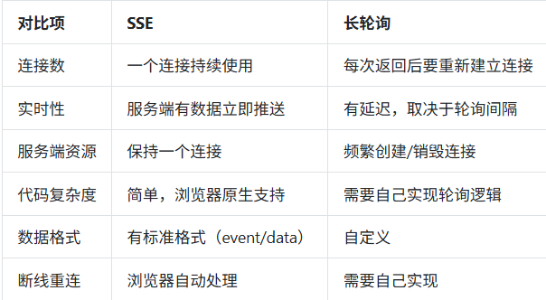

SSE的优势：连接开销小，一个链接用到底；实时性好，SSE是持续推送，数据来了就能立刻发出去，不存在空窗期；SSE直接往流里写数据就好，而长轮询要维护请求-响应的对应关系，超市要处理、客户端没及时发送请求要兜底；浏览器原生支持SSE，有标准的EventSource API、消息类型等，不用自己实现。

线程池的流程：首先检查核心线程数是否已满，没满就创建线程，已满就将任务加入队列，如果队列满了，再检查是否超过最大线程数，没超过就创建线程，超过就拒绝任务。
本项目的线程池有：
    1. SSE发送线程池，IO密集型，大部分线程在等待，可以多开一些线程
        @Bean("sseSendExecutor")
        public ThreadPoolExecutor sseSendExecutor() {
            return new ThreadPoolExecutor(
                                    20,                          // 核心线程：支撑日常并发
                                    100,                         // 最大线程：应对突发流量
                                    60, TimeUnit.SECONDS,        // 空闲 60 秒回收
                                    new LinkedBlockingQueue<>(500),  // 队列容量 500
                                    new ThreadFactoryBuilder().setNameFormat("sse-send-%d").build(),
                                    // 使用CallerRunsPolicy的原因是：1. 工作流节点不能丢 2. 调用者线程占用后，就不会太提交新任务，起到限流的作用 3. 不用额外处理拒绝异常
                                    // 缺点是如果调用线程是主线程，会阻塞主线程，但是本项目调用本身也是线程池里的线程，影响不大
                                    new ThreadPoolExecutor.CallerRunsPolicy()  // 满了就让调用者自己执行，保证不丢失
          );
        }
    2. 工作流执行线程池，混合密集型，CPU干活多，开过多会增大开销
        @Bean("workflowExecutor")
        public ThreadPoolExecutor workflowExecutor() {
        int cpuCount = Runtime.getRuntime().availableProcessors();
        return new ThreadPoolExecutor(
        cpuCount * 2,                // 核心线程：CPU 核数的 2 倍
        cpuCount * 4,                // 最大线程：CPU 核数的 4 倍
        30, TimeUnit.SECONDS,
        new LinkedBlockingQueue<>(200),
        new ThreadFactoryBuilder().setNameFormat("workflow-%d").build(),
        new ThreadPoolExecutor.AbortPolicy()  // 满了就抛异常，快速失败
        );
        }
    3. 定时任务线程池
        @Bean("scheduledExecutor")
        public ScheduledExecutorService scheduledExecutor() {
        return new ScheduledThreadPoolExecutor(
        4,  // 4 个核心线程足够
        new ThreadFactoryBuilder().setNameFormat("scheduled-%d").build()
        );
        }

为什么用 SynchronousQueue 而不是 LinkedBlockingQueue，因为SynchronousQueue 是一个"没有容量"的队列，每个 put 必须等待一个 take。

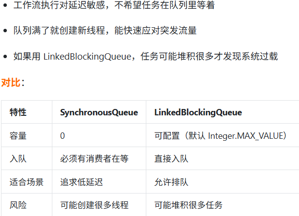

java5引入的Future只能检查任务是否完成，阻塞等待结果，而java8引入的CompletableFuture可以异步回调、链式代码、组合多个异步任务。
使用CompletableFuture要指定线程池，不然会用默认的ForkJoinPool.commonPool()，它是全局共享的，任务多了会互相影响；异常要处理CompletableFuture 的异常不会自动抛出，不处理就丢了。记得用 exceptionally 或 handle 来捕获。

@Async注解工作原理：@Async是Spring提供的注解，让方法异步执行，Spring 通过 AOP 代理实现，调用 @Async 方法时，实际上是代理对象把任务提交到线程池。
坑：
    1. 同类调用不生效，可以使用注入或者拆到另一个类
    2. 需要开启@EnableAsync
    3. 返回值职能制void或者Future
    4. 异步方法的异常不会抛到调用者，需要单独配置 AsyncUncaughtExceptionHandler。
    5. 指定线程池

TTL(TTransmittableThreadLocal)用于**解决线程池场景下ThreadLocal值传递（ThreadLocal只能在当前线程取值）的问题**。
下面是具体使用流程：
    TTransmittableThreadLocal context = new TTransmittableThreadLocal<>();
    context.set("key", "value");
    Executor ttlExecutor = TtlExecutors.getTtlExecutor(executor) // 法一：包装线程池
    ttlExecutor.execute(() -> {
        context.get(); // ✅ 能取到 "userId"
    });
    executor.submit(TtlRunnable.get(() -> { // 法二：包装任务
    // 能拿到上下文
        log.info("traceId={}", RequestContext.TRACE_ID.get());
    }));
这样即使节点在线程池里工作，也能获取到工作流的上下文信息。
java提供的InheritableThread子线程创建时会继承父线程的值，反弹他只在创建新线程的时候复制。在使用线程池的时候，第一次提交任务能继承，后面再提交任务，线程已经存在了，不会再继承，拿到的还是旧值或者 null。
TTL核心：在任务提交时捕获当前线程的上下文，在线程执行前恢复到执行线程，执行完以后清理。依靠的是TtlRunnable任务包装来传递。
不直接使用traceId的原因是因为参数可能有很多（traceId、userId、tenantId。。。）并且有些代码是第三方库的，不好修改方法签名。TTL的好处是透明，业务代码该怎么写怎么写，上下文传递在底层自动完成。

AsyncUtil是一个异步工具类，封装了超时控制和上下文传递。实现了超时控制、上下文传递、线程命名、守护线程、统一管理（全局一个线程池，避免到处new Executor。

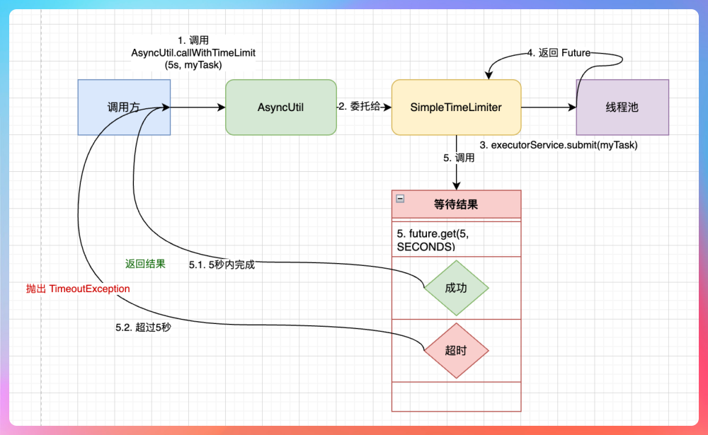

超时控制的实现用到了Google Guava的SimpleTimeLimiter实现：当调用callWithTimeOut时，SimpleTimeLimiter会接受一个Callable<T>对象，并将其提交到它在初始化时绑定的 executorService 线程池中执行。这个提交动作会立即返回一个 Future<T> 对象。
然后执行 future.get(time, unit) 方法，它会阻塞当前线程，但最多只阻塞你指定的时间（ time ）。如果任务在规定时间内完成，future.get() 会在超时前成功获取到 Callable 的返回值。SimpleTimeLimiter 随后将这个值返回，callWithTimeLimit 调用就正常结束了。
如果任务执行超时，也就是说，在指定的 time 过去后， Callable 任务仍未返回结果， future.get() 方法会立即抛出TimeoutException 。这样，callWithTimeLimit 调用就会以 TimeoutException 异常的形式结束。
当 TimeoutException 发生时， SimpleTimeLimiter 会尝试调用 future.cancel(true) 来取消任务，这会向执行任务的线程发送一个“中断”信号。但是如果任务代码能够响应中断 （例如，代码中有 Thread.sleep() ，或者在循环中检查 Thread.currentThread().isInterrupted() ），那么任务会提前终止。
如果任务代码不响应中断 （例如，它正阻塞在一个不可中断的 I/O 操作上，或者在一个不检查中断状态的密集计算循环中），那么即使调用者已经收到了 TimeoutException 并继续往下执行，那超时的后台任务依然会继续运行，直到它自己完成或出错。AsyncUtil 的设计正是利用了这一点：它保证了调用方的逻辑不会被无限期阻塞，同时（在大部分情况下）让超时的任务自生自灭，避免更复杂的资源清理问题。

VariablePool 是工作流引擎的核心组件，负责存储各节点的输入输出变量。工作流并行执行时，多个节点同时读写 VariablePool，线程安全是必须解决的问题。
首先 ，我们使用了线程安全的数据结构，底层用 ConcurrentHashMap 而不是普通 HashMap。
第二，每个节点的变量存在独立的命名空间下（以 node_id 为 key），不同节点写入时互不干扰。B 节点写自己的输出不会影响 C 节点写自己的输出，因为它们操作的是不同的子 Map。
第三，一个节点只有在所有上游节点执行完毕后才开始执行。这意味着当 B 节点读取 A 节点的输出时，A 的数据一定已经写入完成，不存在"读到写了一半的数据"的问题，这是通过 DAG 调度逻辑保证的。
最后，流式输出比较特殊，需要一边输出一边向VariablePool写入数据，我使用了阻塞队列来存放输出的数据，因为队列时天然线程安全的，而且支持生产者-消费者模式，写入方和读取方可以异步配合。

CAS和ConcurrentLinkedQueue

SpringAI是Spring官方提出的AI应用开发框架，提供了类似SpringSecurity的能力，方便的介入大模型。
    1. 大模型有很多，阿里、google等，每家的API格式都不一样。没有统一抽象的话，业务代码会和具体厂商绑死，换一家要改一堆代码。Spring AI 提供了统一的 ChatClient 接口，屏蔽了底层差异。
    2. 简化Prompt，SpringAI提供了模板机制，Prompt可以放到文件中，然后通过变量替换。
    3. SpringAI内置了向量数据库集成，支持PGVector、Pinecone等多种向量库。
    4. SpringAI封装了FunctionCalling，能用注解让LLM调用外部工具。

DeepSeek 的 API 是兼容 OpenAI 格式的，所以用 Spring AI 对接很简单，走 OpenAI 的适配器就行，只需要在 application.yml 里配置base-url 指向 DeepSeek，model 用 DeepSeek 的模型名。

ChatModel和ChaiClient的区别：ChatModel是直接和LLM交互的底层接口，定义了最基础的调用方法，专注于把Prompt发给LLM，拿回Response，使用是要自己构建Prompt，解析Response；ChatClient是 Spring AI 1.0 引入的 API，提供了流式（Fluent）调用方式，用起来更舒服。细粒度设置使用ChatModel。

深入源码排查 Spring AI 1.1 的路径拼接 bug：再对接阿里百炼时遇到的。当时配置了 base-url 为阿里的地址后，请求还是 404。我的排查过程是这样的：
    · 抓包发现请求的 URL 是错的，路径多了一截
    · 跟进 Spring AI 源码，找到 OpenAiApi 类
    · 发现它在构造 URL 时，会把 baseUrl 和 completionsPath 拼起来
    · 但阿里的 API 路径和 OpenAI 不一样，直接拼就错了
Spring AI 假设所有兼容 OpenAI 的模型，API 路径都是 /v1/chat/completions，但阿里百炼的路径是 /compatible-mode/v1/chat/completions。解决办法是在OpenAiApi.build的时候进行判断，如果传入了自定义路径，就用自定义路径，否则使用默认的 /v1/chat/completions。

怎么实现"统一抽象"来支持 OpenAI、DeepSeek、智谱等多个模型:采用**适配器模式**。
    1. 定义统一接口，接口用统一的 Request/Response 结构，屏蔽各厂商的差异。
    2. 实现各厂商适配器。
    3. 用工厂选择适配器。
    4. 业务层完全感知不到底层是哪家，换模型只需要改 provider 参数，业务逻辑一行不用动。

Spring AI 的流式响应是基于 Project Reactor 实现的，Flux<ChatResponse> 是响应式编程中的核心概念。简单说，Flux 是一个**可以发射 0 到 N 个元素的异步序列**。调用Flux的subscribe以后，每个 token 到达就会触发。
**LLM 生成一个 token → Spring AI 收到推给 Flux → WebFlux 推给 HTTP 响应 → 前端收到渲染，不需要等全部生成完。**
stream的常用操作：
    // 转成列表（会等全部完成）
    List all = stream.collectList().block();
    // 拼成完整字符串
    String full = stream.reduce("", (a, b) -> a + b).block();
    // 加超时
    stream.timeout(Duration.ofSeconds(30));
    // 出错时返回默认值
    stream.onErrorReturn("生成失败");
    // 处理每个元素
    stream.doOnNext(chunk -> log.info("收到: {}", chunk));

什么是**Advisor**：Advisor是SpringAI的拦截器/插件机制，可以在调用大模型前后插入自定义逻辑。
    ChatClient.create(chatModel)
                .defaultAdvisors(
                    new MessageChatMemoryAdvisor(chatMemory),  // 添加记忆
                    new QuestionAnswerAdvisor(vectorStore)    // 添加 RAG
                )
                .prompt()
                .user("你好")
                .call();

Spring AI 的 Function Calling 功能是怎么实现的：Function Calling让大模型能够调用外部工具，定义一个工具配置类，使用@Bean和@Description注解定义。@Description 很重要，LLM 会根据这个描述判断什么时候该调用这个函数。描述写得好，LLM 选择就准。在使用时通过 chatClient.functions() 指定可用函数：

**提示词工程Prompt Engineering**，同样一个问题，提示词不同，大模型的响应质量天差地别。
**System Prompt** 是给 AI 的"人设说明书"，定义它是谁、该怎么表现、有什么限制。
**User Prompt** 是用户的具体问题或指令，是"这次要做什么"。

VariableTemplateRender 实现 Prompt 模板渲染的原理：工作流里，用户可以这样写 Prompt 模板，{{node_id.variable_name}} 是变量占位符，运行时要从 VariablePool 里取对应值替换进去。核心是正则匹配 + 变量池查找 + 字符串替换。

**Token** 是大模型处理文本的基本单位，可以理解为"词片段"。不是一个汉字就是一个 Token，也不是一个单词就是一个 Token。大模型用的分词算法（如 BPE）会把文本切成更小的片段。大模型的推理成本（算力、显存占用）直接取决于模型处理和生成的 Token 数量。同样的语义，中文通常比英文消耗更多 Token。因为大多数模型的分词器是基于英文语料训练的，对中文的"压缩率"较低。

**Temperature** 控制大模型输出的"随机性"或"创造性"，取值范围一般是 0 到 2。大模型输出时，会计算每个 Token 的概率。Temperature 低：概率高的 Token 更容易被选中，输出更确定 Temperature 高：概率分布更平均，低概率 Token 也有机会被选中，输出更随机

**幻觉（Hallucination）**是指大模型"一本正经地胡说八道"，生成的内容看起来很合理，但其实是错的。比如问"鲁迅和周树人的关系"，模型可能回答"他们是好朋友"...缓解的办法有 
    1. RAG（检索增强生成） 
    2. 降低Temperature，减少随机性
    3. 明确要求，在Prompt中说如果不确定回答我也不知道
    4. 限定范围，"只根据我提供的信息回答，不要使用外部知识"

LangGraph4J 是 LangGraph（Python版本）的 Java 实现，是一个用于构建**有状态、可循环**的多步骤LLM应用的编排框架。而LangChain4j更偏向于一个 LLM 应用的工具链和组件库。
LangGraph4J的核心是StateGraph，需要先定义一个状态类，里面包含消息历史、中间结果这些字段，每个节点都能读写共享状态，而LangChain4J没有内置的状态持久化机制，需要自己维护上下文。
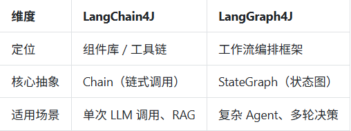

